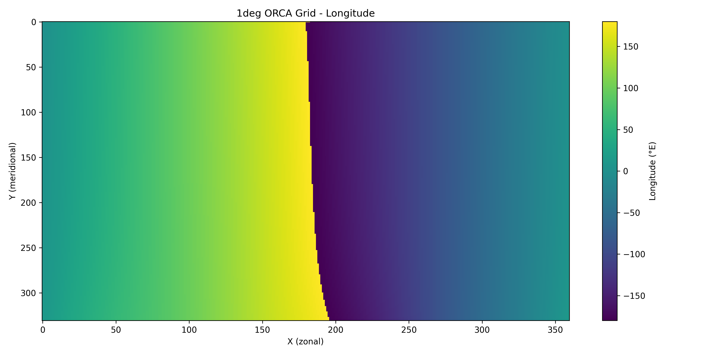
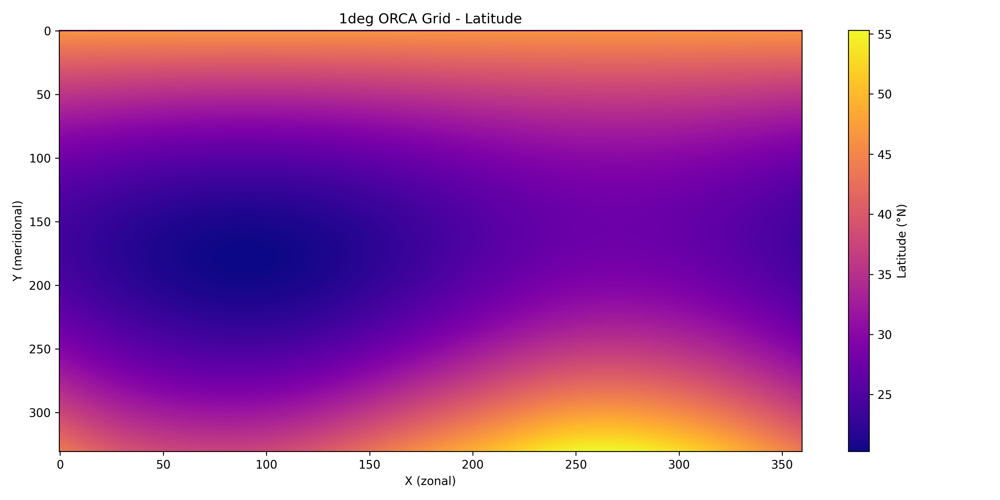
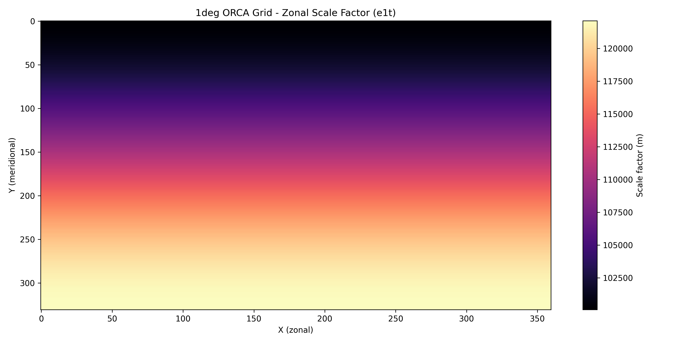

# ORCA Grid Builder

A modular Python library for generating global ocean grids following the ORCA grid family conventions, compatible with NEMO and other ocean models.

## Overview

The ORCA Grid Builder implements the semi-analytical method described in Madec & Imbard (1996) for creating global orthogonal curvilinear ocean meshes that avoid the North Pole singularity. The library generates NEMO-compliant NetCDF files and supports extension to other ocean models through a modular architecture.

## Features

- **NEMO ORCA Grid Generation**: Full implementation of the Madec & Imbard (1996) algorithm
- **Multiple Resolutions**: Support for 1°, 0.5°, and other resolutions
- **JAX Optimization**: GPU/CPU acceleration for fast grid generation
- **Modular Architecture**: Easy extension to other ocean models (Veros, MOM6, etc.)
- **NEMO Compliance**: Generates NetCDF files compatible with NEMO domain_cfg requirements
- **Comprehensive Validation**: Built-in validation against reference grids

## Installation

```bash
pip install orca-grid-builder
```

Or install from source:

```bash
git clone https://github.com/your-repo/orca-grid-builder.git
cd orca-grid-builder
pip install .
```

## Quick Start

### Basic Usage

```python
from orca_grid import ORCAGridBuilder

# Create a 1° resolution ORCA grid
builder = ORCAGridBuilder(resolution="1deg")
grid_data = builder.generate_grid()

# Write to NEMO-compliant NetCDF file
builder.write_netcdf("domain_cfg.nc")
```

### Using JAX Optimization

```python
# Generate grid using GPU acceleration
builder = ORCAGridBuilder(resolution="1deg")
grid_data = builder.generate_grid(use_jax=True)
builder.write_netcdf("domain_cfg_gpu.nc", use_jax=True)
```

### Command Line Interface

```bash
# Generate 1° grid
python -m orca_grid 1deg my_grid.nc

# Use GPU acceleration
python -m orca_grid --jax 1deg gpu_grid.nc
```

## Modular Architecture

The library uses a modular design that separates core grid generation from model-specific requirements:

```python
from orca_grid.modular_factory import UnifiedGridBuilder

# Generate grid for NEMO
nemo_builder = UnifiedGridBuilder(model_name="nemo", resolution="1deg")
nemo_grid = nemo_builder.generate_grid()
nemo_builder.write_output("nemo_grid.nc")

# Generate grid for Veros
veros_builder = UnifiedGridBuilder(model_name="veros", resolution="1deg")
veros_grid = veros_builder.generate_grid()
veros_builder.write_output("veros_grid.json")
```

## Mathematical Foundation

The ORCA grid uses a semi-analytical method:

1. **Stereographic Projection**: Grid construction in polar plane
2. **Embedded Circles**: J-curves (parallels) defined as series of circles
3. **Orthogonal Meridians**: I-curves computed numerically
4. **Sphere Projection**: Conversion to spherical coordinates
5. **Tripolar Grid**: Two north poles placed on land to avoid singularity

## Grid Characteristics

### 1° Resolution ORCA Grid

- **Dimensions**: 331 × 360 × 75 (y × x × z)
- **Horizontal Resolution**: ~1° × 1° nominal
- **Vertical Levels**: 75 levels with partial cells
- **Grid Type**: Tripolar orthogonal curvilinear
- **North Pole Treatment**: Displaced to Canada and Russia
- **Equator**: Mesh line for better equatorial dynamics

### Key Features

- **Arakawa C-grid**: Staggered grid points (T, U, V, F)
- **Partial Cells**: Better bathymetry representation
- **Low Anisotropy**: Maintained ratio e1/e2 ≈ 1
- **North Fold**: Special boundary condition handling
- **Bering Strait**: Open without special treatment

## Validation

The library includes comprehensive validation tools:

```python
from orca_grid import validate_grid

report = validate_grid("generated.nc", "reference.nc")
print(f"Validation passed: {report['validation_passed']}")
```

## Supported Ocean Models

### NEMO

- Full ORCA grid support
- NEMO-compliant NetCDF output
- All required variables and attributes
- Proper domain_cfg structure

### Veros

- Regular grid adaptation
- Veros-specific format support
- Easy integration with Veros workflows

### Extensible Architecture

The modular design makes it easy to add support for other ocean models:

```python
from orca_grid.abstract_base import OceanModelAdapter

class NewModelAdapter(OceanModelAdapter):
    def to_model_format(self, grid_data):
        # Convert to your model's format
        pass
    
    def from_model_format(self, model_data):
        # Convert from your model's format
        pass
    
    def get_model_name(self):
        return "YourModel"
```

## API Reference

### ORCAGridBuilder

Main class for ORCA grid generation.

**Methods:**
- `generate_grid(use_jax=False)`: Generate grid data
- `write_netcdf(filename, use_jax=False)`: Write to NetCDF file
- `generate_and_validate(reference_file)`: Generate and validate

### NEMOGridGenerator

NEMO-specific implementation.

**Methods:**
- `generate_grid(use_jax=False)`: Generate NEMO grid
- `write_netcdf(filename)`: Write NEMO-compliant NetCDF
- `get_grid_type()`: Return grid type
- `get_resolution()`: Return resolution

### UnifiedGridBuilder

Model-agnostic interface.

**Methods:**
- `generate_grid(**kwargs)`: Generate grid for any model
- `write_output(filename, **kwargs)`: Write model-specific output
- `get_model_info()`: Get model information

## Examples

See the `examples/` directory for complete usage examples:

- `basic_usage.py`: Basic grid generation
- `modular_demo.py`: Modular architecture demonstration
- `validation_example.py`: Grid validation
- `performance_comparison.py`: CPU vs GPU performance

## Development

### Requirements

- Python 3.9+
- NumPy
- JAX
- xarray
- netCDF4

### Testing

```bash
python -m pytest tests/
python example.py
```

### Contributing

Contributions are welcome! Please follow the existing code style and add tests for new features.

## License

MIT License

## References

- Madec, G., & Imbard, M. (1996). A global ocean mesh to overcome the North Pole singularity. Climate Dynamics, 12(6), 381-388.
- NEMO Ocean Engine Reference Manual
- Veros Ocean Model Documentation

## Support

For issues and questions, please open a GitHub issue or contact the maintainers.

## Roadmap

- Additional resolution options (0.25°, 0.1°)
- Enhanced validation suite
- More ocean model adapters
- Performance optimization
- Web interface for grid generation

## Visualization

The library includes visualization tools to inspect the generated grids:

### Grid Structure Plots


*Longitude coordinates for 1° ORCA grid (generated on-demand)*

  
*Latitude coordinates for 1° ORCA grid (generated on-demand)*

### Scale Factor Plots


*Zonal scale factors for 1° ORCA grid (generated on-demand)*


*Meridional scale factors for 1° ORCA grid (generated on-demand)*

### Staggered Grid Points


*Arakawa C-grid staggered points (T, U, V, F) (generated on-demand)*

### Resolution Comparison


*Comparison of 1° and 2° ORCA grid resolutions (generated on-demand)*

### Generating Your Own Plots

```python
from orca_grid import plot_grid_structure, plot_scale_factors, plot_staggered_points

# Plot a specific grid
plot_grid_structure('output/grids/my_grid.nc', 'My ORCA Grid', 'output/plots/my_grid_plot')
plot_scale_factors('output/grids/my_grid.nc', 'My ORCA Grid', 'output/plots/my_scale_factors')
```

### Generating Grid Files (On-Demand)

Large grid files are not included in version control due to GitHub's 100MB file size limit. Generate them on-demand:

```bash
# Generate example grids
python output/examples/comprehensive_example.py

# Generate visualization plots  
python output/examples/generate_plots.py
```

The plots help visualize:
- Grid coordinate systems
- Scale factor distributions
- Staggered point locations
- Resolution differences
- Grid quality and orthogonality
